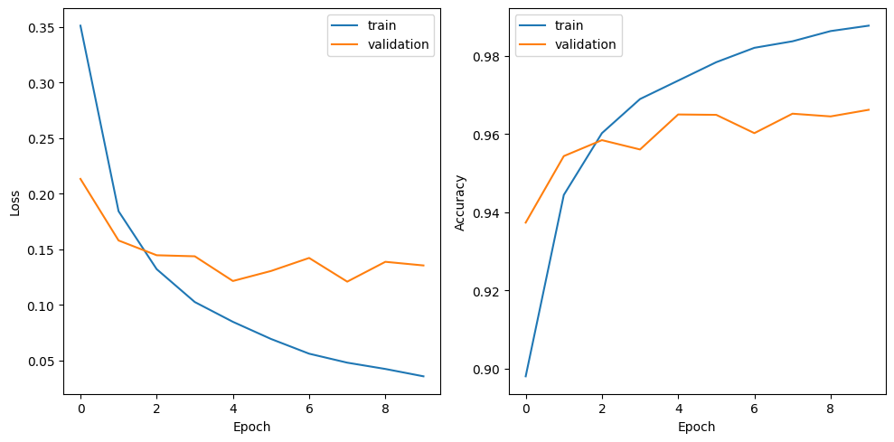

# Reimplementation of Kolmogorov-Arnold Networks (KAN)

A simplier implementation of the Kolmogorov-Arnold Networks, a novel neural network architecture inspired by the Kolmogorov-Arnold theorem from dynamical systems theory.


## Overview

Kolmogorov-Arnold Networks (KAN) are a new type of neural network architecture that leverages the Kolmogorov-Arnold theorem from dynamical systems theory. This theorem states that any continuous function on a high-dimensional cube can be approximated by a composition of a small number of continuous functions of a single variable and a small number of continuous functions of a few variables.

KAN takes advantage of this theorem by constructing a neural network architecture that consists of a series of alternating layers: single-variable layers and multi-variable layers. This design allows KAN to efficiently approximate complex, high-dimensional functions while maintaining a relatively simple and interpretable structure.

## Features
- **Efficient Approximation**: KAN can accurately approximate complex, high-dimensional functions with a relatively small number of parameters.

- **Interpretable Structure**: The alternating single-variable and multi-variable layers in KAN provide a more interpretable structure compared to traditional neural networks.

- **Theoretical Foundations**: KAN is based on the well-established Kolmogorov-Arnold theorem from dynamical systems theory, providing a solid theoretical foundation for its architecture.

## Model's Training Performance 

### Training & Validation Accuracy and Loss



The image above shows the training and validation accuracy and loss curves for the KAN model implemented in this repository.

## Getting Started

- Make sure to install the necessary python libraries 
```
pip install -r requirements.txt
```
- To get started with this implementation of KAN, please refer to the `model.py` to see what the architecture look like.
- For training and validation, you can check out the `train.py`

```
python train.py
```

- You can checkout `demo.ipynb` for a quick run.

## References

- [Blealtan. An Efficient Implementation of Kolmogorov-Arnold Network](https://github.com/Blealtan/efficient-kan)
- [KindXiaoming - pykan (GitHub)](https://github.com/KindXiaoming/pykan)
- [Ziming Liu, Yixuan Wang, Sachin Vaidya, Fabian Ruehle, James Halverson, Marin Soljaciˇc, Thomas Y. Hou, and Max Tegmark. KAN: Kolmogorov–Arnold Networks](https://arxiv.org/abs/2404.19756)